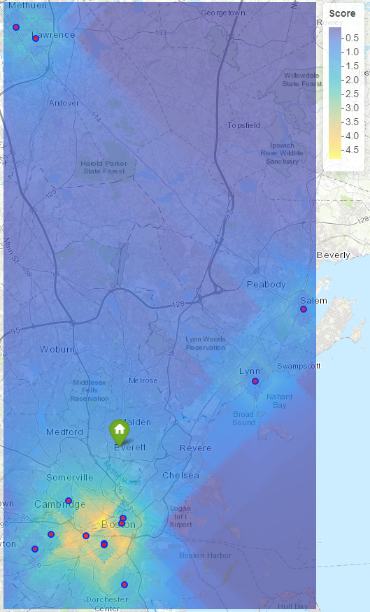

---
title: 'rgeoprofile: Geographic Profiling Methods for Serial Crime Analysis'
tags:
- R
- serial crime
- geographic profiling
authors:
- name: Jamie S. Spaulding^[Corresponding author]
  orcid: 0000-0002-4232-368X
  affiliation: 1
- name: Keith B. Morris
  affiliation: 2
affiliations:
- name: Department of Criminal Justice and Forensic Science, Hamline University, Saint Paul, MN, USA
  index: 1
- name: Department of Forensic and Investigative Science, West Virginia University, Morgantown, WV, USA
  index: 2
date: "3 Aug 2020"
bibliography: rgeoprofile-ref.bib

# Summary

`rgeoprofile` [@Spaulding:2020] is an R [@base-r:2020] package which implements functions for the analysis of serial crime incidents. The package contains several algorithms for the geographical profiling of serial incidents to prioritize the area with the highest calculated likelihood of including the anchor point or home base of a given perpetrator. Geographic profiling is a technique used to predict the location of an offender’s residence (anchor point) given information regarding crime locations [@Rossmo:1999]. Current methods for prediction of offender residence draw from theoretical approaches from psychology [@Rossmo:1999; @Blackburn:1993], criminology [@Elmes:2014], [@Rossmo:1999], [@Cohen:1979; @Cornish:2014; @Brantingham:1993], and geography [@Rossmo:1999; @Brantingham:1981]. Several solutions have been proposed to model and assess the potential residence of an offender given their serial incidents. Geographic profiling methods in the package are based upon the 'Dragnet' software [@Canter:2000], the 'CrimeStat' software [@Levine:2013], and the criminal geographic targeting (CGT) model [@Rossmo:1995; @Rossmo:1999]. 

# Package Functionality

The rgeoprofile package contains a sample dataset `desalvo`[^1]  which contains information from the Boston Strangler serial incidents, attributed to Albert DeSalvo. In addition, the package is also comprised of ten functions: six which utilize a distance decay methodology, and four which are centrographic point predictions.

* `cgt_profile`: the CGT model developed by DK Rossmo [-@Rossmo:1995; -@Rossmo:1999]. This model utilizes Manhattan distance for the calculations and assumes the presence of a buffer zone around the incidents.
* `linear_profile`: calculation of geographic profile using a linear decay function from each incident.
* `lognorm_profile`: calculation of geographic profile using a lognormal function from each incident. This model is similar to the normal model except a skew in the peak likelihood to either side (closer or further from incident) can be specified by the user.
* `neg_exp_profile`: calculation of geographic profile using a negative exponential decay from each incident. The user can select different variants (in the default parameters) including the 'CrimeStat' base model [@Levine:2013], the 'Dragnet' model [@Canter:2000], or whether a buffer and plateau is present at the start of the decay function.
* `norm_profile`: calculation of geographic profile using a normal decay function from each incident.
* `trun_neg_exp_profile`: calculation of geographic profile using a truncated negative exponential decay from each incident. A joint function is utilized which is composed of both a local linear increase to a peak likelihood and then a negative exponential decay as distance further increases.
* `circle_center`: centrographic point prediction by calculation of the center of a circle which bounds the incident coordinate set.
* `cmd_pred`: centrographic point prediction by calculation of the center of minimum distance between the incident coordinate set.
* `geom_mean_pred`: centrographic point prediction by calculation of the geometric mean for the incident coordinate set.
* `harm_mean_pred`: centrographic point prediction by calculation of the harmonic mean for the incident coordinate set.

Each of the decay model functions has a similar implementation. Firstly, a grid of $n$ cells is fit over the incidents. The user can specify $n$ to adjust the coarseness (cell width) of the resultant profile map, or by default a grid of size $n$ equals $40,000$ cells[^2] is applied. Next, the Euclidean distance (unless otherwise specified, *e.g.* CGT) between the center of each grid cell and each incident is calculated and used to calculate the likelihood of that cell area using the decay model of the particular function being applied. The equations for each decay function are given in the table below. 

Decay Function                 | Equation
------------------------------ | ---------
CGT                            | $$P_{(i,j)} = k \sum_{n=1}^{n} \frac{\phi_{(i.j)}}{(|X_{i}-x_{n}|+|Y_{i}-y_{n}|)^f} + \frac{(1-\phi_{(i.j)})(B^{g-f})}{(2B-|X_{i}-x_{n}|-|Y_{i}-y_{n}|)^g}$$
Linear                         | $$P_{(i,j)} = A+bd_{i,j}$$
Lognormal                      | $$P_{(i,j)} = A \frac{1}{d_{i,j}^2 S \sqrt{2\pi}}^\frac{-[\ln{d_{i,j}^2}- \overline{d}]^2}{2S^2}$$
Negative Exponential           | $$P_{(i,j)} = Ae^{-bd_{i,j}}$$
Normal                         | $$P_{(i,j)} = A \frac{1}{S\sqrt{2\pi}}e^{\frac{-1}{2} (\frac{(d_{i,j}- \overline{d})}{S})^2}$$
Truncated Negative Exponential | $P_{(i,j)} = bd_{i,j}\ for\ 0 \leq d_{i,j} \leq d_{p}$   $P_{(i,j)} = Ae^{-Cd_{i,j}}\ for\ d_{i,j} > d_{p}$

Once all cells have been evaluated, the likelihood of each cell is used to create a raster image which models an optimal search area for investigators. The resultant geographic profile is given as a base map with the developed raster layer overlaid using a Parula (CITE) color gradient to facilitate user observation of the likelihood-based search area. An example geographic profile using the provided dataset for the Boston Strangler incidents and the CGT decay function is presented in **Figure 1**.

 

 

The centrographic models in the package analyze the given incident coordinates and render a point-based prediction of the serial perpetrator residence. The equations of these functions are presented in the table below. 

Centrographic Method       | Equation
-------------------------- | ---------
Center of Minimum Distance | $$W(\overline{x},\overline{y}) = \sum_{n=1}^{n} \text{dist}((x_{i}, y_{i}),(\overline{x},\overline{y})) $$
Center of the Circle       | Given $n$ coordinates, mid-point of the two furthest points.
Geometric Mean             | $$\overline{x} = e^{\frac{1}{n} \sum_{i=1}^{n} \log{x_{i}}} \\ \overline{y} = e^{\frac{1}{n} \sum_{i=1}^{n} \log{y_{i}}}$$
Harmonic Mean              | $$\overline{x} = \frac{n}{\sum_{i=1}^{n}\frac{1}{x_{i}}} \\ \overline{y} = \frac{n}{\sum_{i=1}^{n}\frac{1}{y_{i}}}$$

These models are dependent on the assumption that the perpetrator of the incidents lives rather central relative to the incidents and should be used when the analyst or investigator has information which corroborates this assumption. The functions are based upon spatial mean equations, however, the examiner can also calculate an algebraic mean using the `mean()` function in the base package [@base-r:2020] for R. 

# Discussion and Conclusion

`rgeoprofile` is a package which provides an implementation of serial perpetrator crime analysis into the R programming environment. The package was designed to be user-friendly and robust to accommodate larger input data. The combination of centrographic and decay models provide an analytical platform with wide usage and value for the crime analysis community. The package further serves to increase the capabilities of crime analysis units to utilize these techniques for suspect prioritization or potential intelligence toward the closure of serial incident cases. Additionally, the utilization of the R programming language facilitates both transparency and reproducibility in the analysis of crime incidents which are critical elements for integrity and admissibility in the adjudication of crime incidents. Academically, the package has implications which facilitate research into the performance and comparison of centrographic and decay-based prediction systems, a current debate in the literature [@Bennell:2007; @Rossmo:2005; @Snook:2005]. Additionally, the [Github repository](https://github.com/JSSpaulding/rgeoprofile) for the package contains supplementary files which aid in usage of the package. The ‘NEWS.md’ file outlines the changes to the package throughout versions. This file is updated each time any change is made to the package to ensure users are apprised of any and all changes. There is also a ‘vignettes‘ folder which contains a markdown document that serves as a guide to the package. The functions are explained in detail with examples to facilitate user comprehension of the functions. The introductory vignette is also integrated into the package; available using: browseVignettes("rgeoprofile"). In summation, the contribution of the `rgeoprofile` package is through flexibile application, transparency, and a no cost start to finish solution for law enforcement/security agencies tasked with perpetrators of serial crimes.

The rgeoprofile package is hosted on an open source [Github repository](https://github.com/JSSpaulding/rgeoprofile) and on the official [Comprehensive R Archive Network (CRAN)](https://cran.r-project.org/package=rgeoprofile) repository.

# References

[^1]: The provided dataset contains the following information about each victim and incident: name, age, date, latitude, and longitude.
[^2]: The grid size of 40,000 cells was chosen as default based upon the CGT model method outlined by Rossmo [-@Rossmo:1995].
